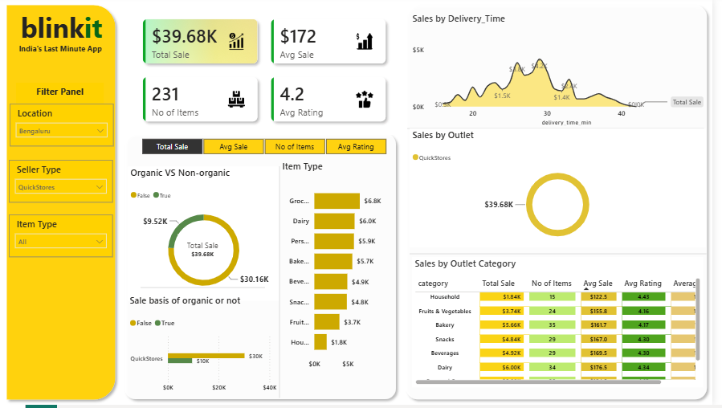

# 🛒 Blinkit Sales Dashboard

## 📌 Project Overview

This project is an interactive Power BI dashboard developed to analyze Blinkit grocery sales. The dashboard helps visualize sales performance, outlet analysis, item categories, customer ratings, and delivery time using interactive charts and KPIs.

---

## 📊 Dashboard Preview

---

## 🎯 Business Objectives

- Analyze total sales performance
- Compare outlet-wise sales
- Identify top-performing item categories
- Monitor customer ratings
- Analyze delivery time trends

---

## 📈 Key Performance Indicators (KPIs)

- 💰 Total Sales
- 💵 Average Sales
- 📦 Number of Items
- ⭐ Average Rating

---

## 📊 Dashboard Features

- Sales by Delivery Time
- Sales by Outlet
- Sales by Outlet Category
- Sales by Item Type
- Organic vs Non-Organic Sales
- Interactive Filters

---

## 🛠️ Tools Used

- Power BI
- Microsoft Excel

---

## 📂 Files Included

- Blinkit Dashboard.pbix
- Dashboard.PNG
- Blinkit Dashboard.pdf
- blinkit_dataset.csv

---

## 💡 Key Insights

- Delivery time significantly impacts sales performance.
- Customer ratings remain consistently high.
- Different outlet categories contribute differently to total sales.
- Interactive filters help analyze sales by location, seller type, and item type.

---

## 👩‍💻 Author

**Anu**

Aspiring Data Analyst

### Skills
- Power BI
- SQL
- Excel
- Python
- Data Visualization
- Data Cleaning

---

⭐ If you found this project useful, feel free to star this repository.

